# NetMedEx

[](https://pypi.org/project/netmedex/)
[](https://yehzx.github.io/NetMedEx/)  

NetMedEx is an AI-powered knowledge discovery platform designed to transform biomedical literature into actionable insights. Unlike traditional tools that merely extract entities, NetMedEx leverages **Hybrid Retrieval-Augmented Generation (Hybrid RAG)** to synthesize structured co-mention networks with unstructured text, providing a holistic understanding of biological relationships.

## 🌟 Core Philosophy: Scaffolding for Discovery

In NetMedEx, the **Co-Mention Network** serves as a structural "scaffolding." While the network visualizes the landscape of bio-concepts (genes, diseases, chemicals, etc.), the **AI-driven Semantic Layer** breathes life into these connections by extracting evidence, identifying relationship types, and answering complex natural language queries.

---

## 🚀 Getting Started

NetMedEx offers flexible ways to interact with the platform:

1. [Web Application (via Docker)](#-web-application-via-docker) - **Recommended**
2. [Web Application (Local)](#-web-application-local)
3. [Command-Line Interface (CLI)](#-command-line-interface-cli)
4. [Python API](#-package-api)

---

## 🐳 Web Application (via Docker)

The easiest way to start is using [Docker](https://www.docker.com/). Run the command below (adding `-d` to run in background) and open `localhost:8050` in your browser:

```bash
docker run -d -p 8050:8050 --rm lsbnb/netmedex
```

## 📦 Installation

Alternatively, install via PyPI for local hosting or CLI access:

```bash
pip install netmedex
```
*Recommended: Python >= 3.11*

## 💻 Web Application (Local)

Launch the interactive dashboard locally:

```bash
netmedex run
```

---

## 🤖 Hybrid RAG-Powered Discovery

NetMedEx features an interactive **Chat Panel** driven by **Hybrid RAG**, which combines the power of large language models (LLMs) with specialized bio-medical knowledge graphs.

<p align="center">
  
  <br>
  <i>Figure 1: NetMedEx Hybrid RAG Architecture combining Text and Graph RAG for chatting with biomedical knowledge.</i>
</p>

### Key Capabilities
- **Hybrid RAG Chat**: Synthesizes **unstructured text** (abstracts) and **structured graph knowledge** (paths and neighbors).
- **Natural Language to Query**: Ask in plain English; NetMedEx converts it to optimized PubTator3 syntax.
- **Semantic Evidence Extraction**: Automatically identifies relationship types (e.g., *treats*, *inhibits*) and confidence scores.
- **Contextual Reasoning**: Identifies shortest paths and relevant subgraphs to explain hidden connections between entities.

### Setup AI Engine
1. Obtain an API key from [OpenAI](https://platform.openai.com/api-keys) or set up a local LLM endpoint (e.g., Ollama).
2. Configure via **"Advanced Settings"** in the web interface or via `.env` file.

> [!TIP]
> **Connecting to Local LLMs (Ollama/LM Studio):**
> - **Linux/Docker**: Use your host IP (e.g., `http://192.168.1.100:11434`).
> - **Windows/macOS (Docker)**: Use `http://host.docker.internal:[PORT]`.

---

## 🖼️ Interface & Quick Tour

The workspace follows a logical discovery workflow across three main operational panels.

### 1. Search & Configuration (The Entry Point)
The **Search Panel** is where you define your research scope and configure the AI engine.

<p align="center">
  
  <br>
  <i>Figure 2: The Search Panel for keyword and natural language querying.</i>
</p>

Expand **Advanced Settings** to configure your LLM provider. This is a crucial first step for enabling semantic analysis.

<p align="center">
  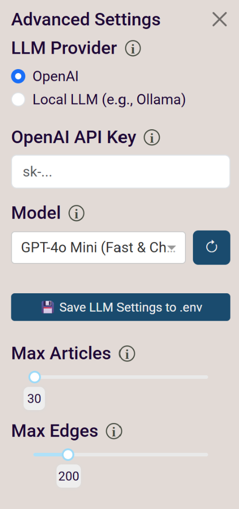
  <br>
  <i>Figure 3: Configuring the AI Engine (OpenAI or Local) in Advanced Settings.</i>
</p>

<p align="center">
  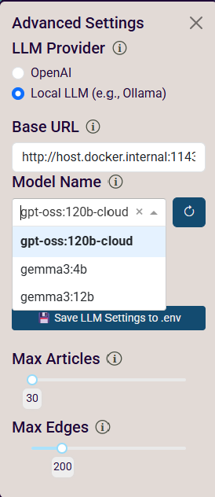
  <br>
  <i>Figure 4: Selecting a specific model for local AI processing via the dropdown menu.</i>
</p>

Users can also upload previously downloaded PubTator format files for re-analysis.

<p align="center">
  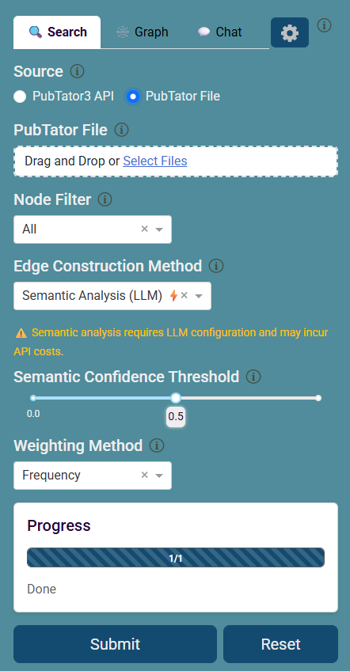
  <br>
  <i>Figure 5: Uploading PubTator files for re-analysis within the Search Panel.</i>
</p>

### 2. Graph & Scaffolding (Structural View)
The **Graph Panel** visualizes the co-mention/ semantic analyzed network, providing the visualization of search results for your research. Using the shift key to select sub-network, those selected nodes and edges will be highlighted as the base for chat in next step. Users can visualize the network using different layouts and community detection algorithms. Users also can save the selected sub-network to a JSON file/ orginal pubtator3 file/ XML for Cytoscape for further analysis. 

<p align="center">
  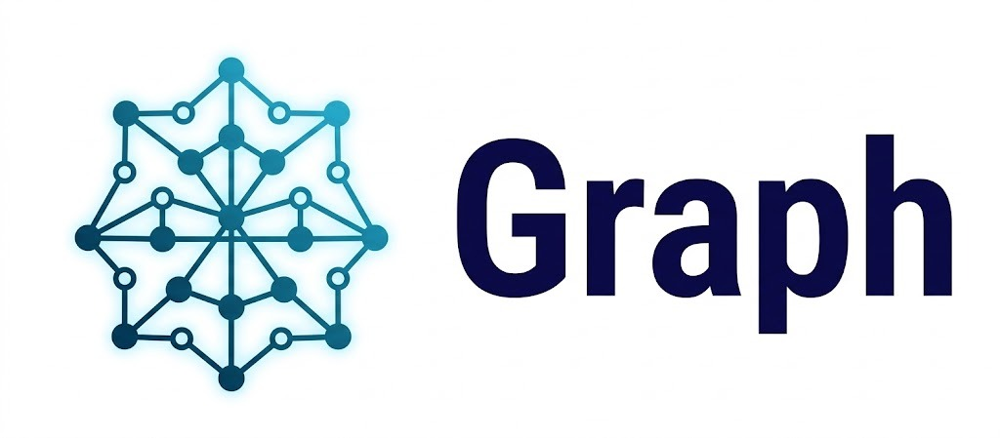
  <br>
  <i>Figure 6: Interactive Knowledge Graph showing Bio-Concept connections.</i>
</p>

<p align="center">
  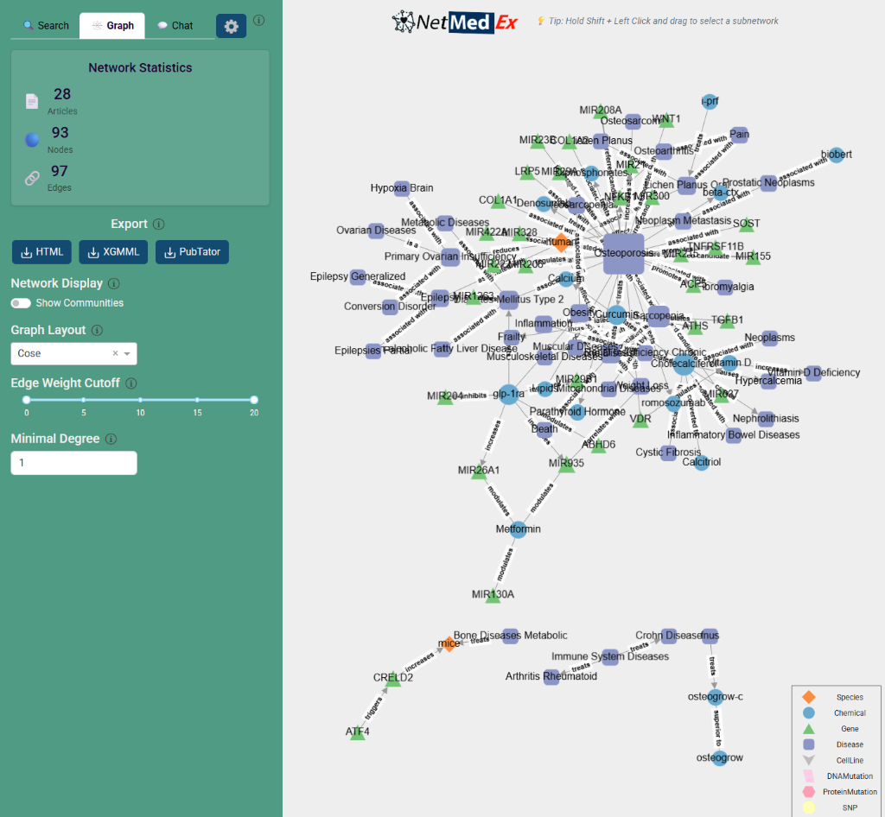
  <br>
  <i>Figure 7: High-resolution view of the Graph Panel interface.</i>There are several options in the top right corner of the graph panel, including layout, community detection, and save. 
</p>

<p align="center">
  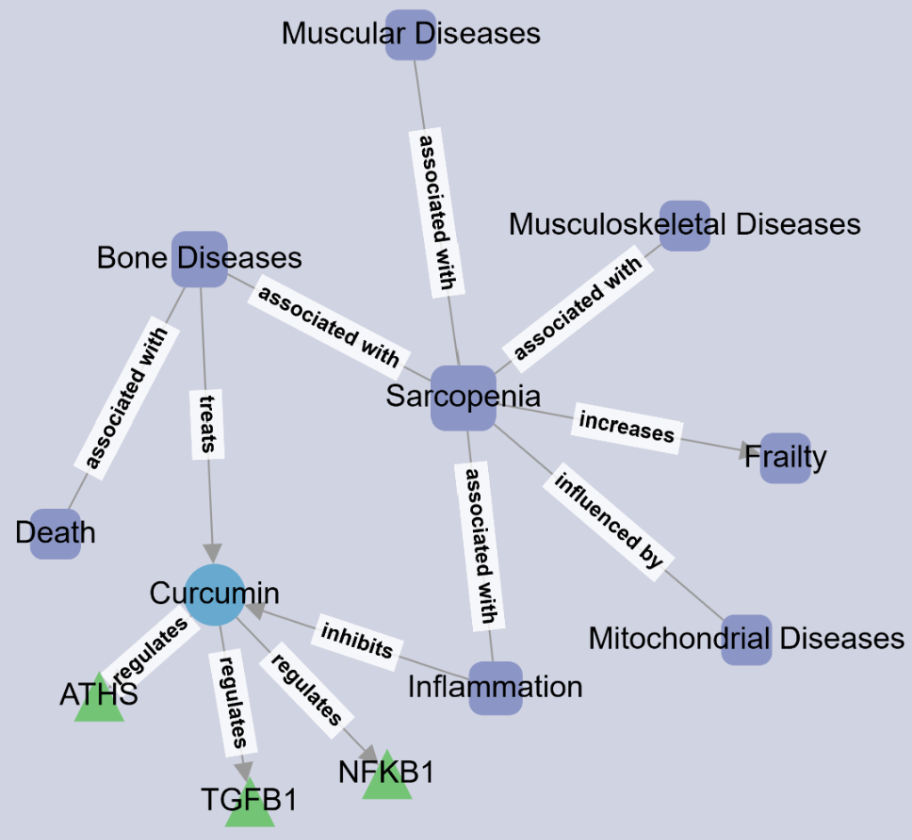
  <br>
  <i>Figure 8: Case study: Visualizing the Sarcopenia-related network using NetMedEx to depict the relationships in semantic level between genes, diseases, chemicals, and species.</i>
</p>

- **Nodes**: Genes, Diseases, Chemicals, and Species.
- **Edges**: Literature co-occurrence. Thicker edges indicate higher frequency.
- **Clusters**: Use the **Community Detection** feature to group related concepts automatically.

<p align="center">
  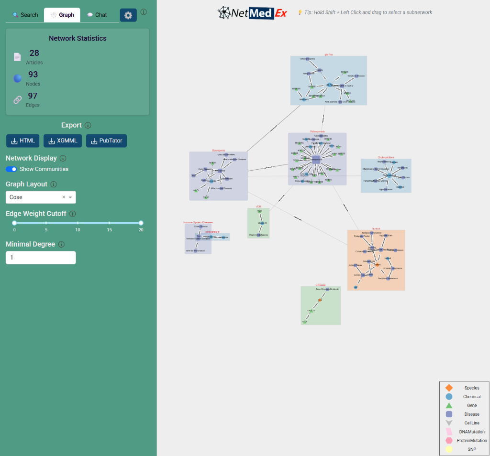
  <br>
  <i>Figure 9: Automated community detection for functional clustering.</i>
</p>

<p align="center">
  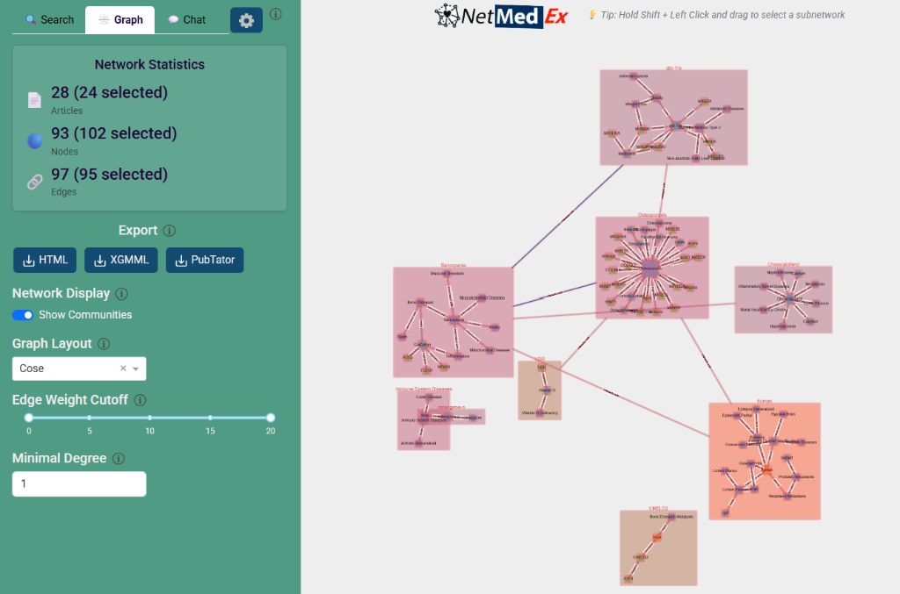
  <br>
  <i>Figure 10: Selecting a sub-network by holding the Shift key to isolate relevant nodes and edges as the base for hybridRAG to chat with.</i>
</p>


### 3. Chat & Semantic Insights (Interpretation)
The **Chat Panel** provides the deep semantic layer, interpreting the graph using LLMs.

<p align="center">
  
  <br>
  <i>Figure 11: Hybrid RAG Chat for natural language reasoning over the network.</i>
</p>

<p align="center">
  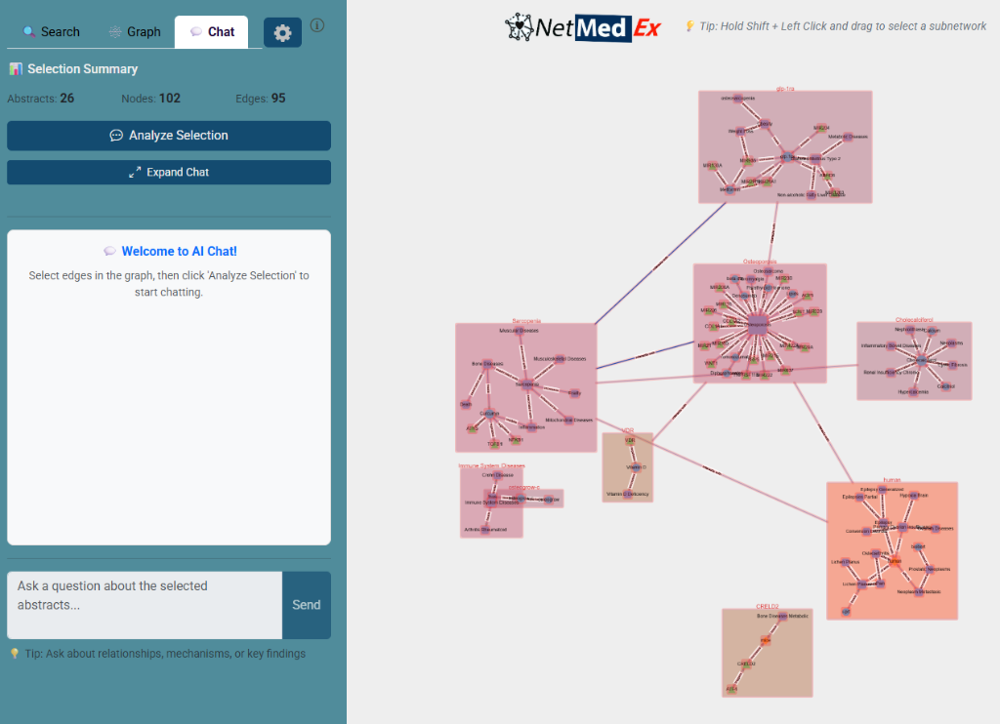
  <br>
  <i>Figure 12(A): Press the "Analyze Selection" button to construct RAGs for communications with the selected sub-network.</i>
</p>

<p align="center">
  
  <br>
  <i>Figure 12(B): RAG generating to prepare the chat later.</i>
</p>

<p align="center">
  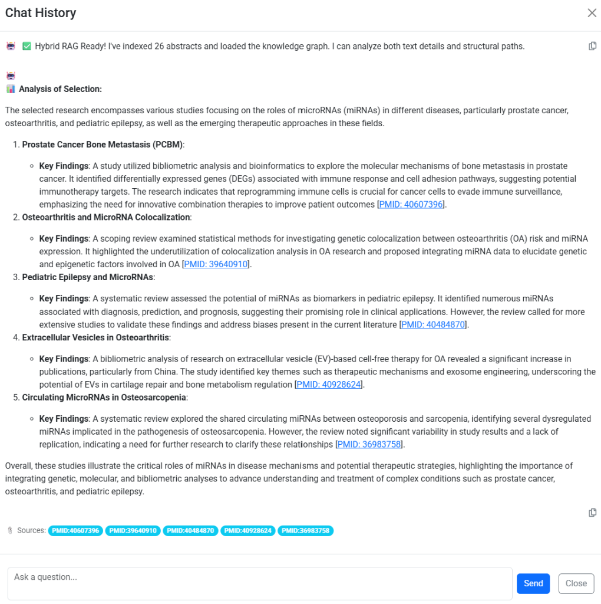
  <br>
  <i>Figure 13: The Chat History panel for managing and reviewing previous discovery sessions.</i>
</p>

<p align="center">
  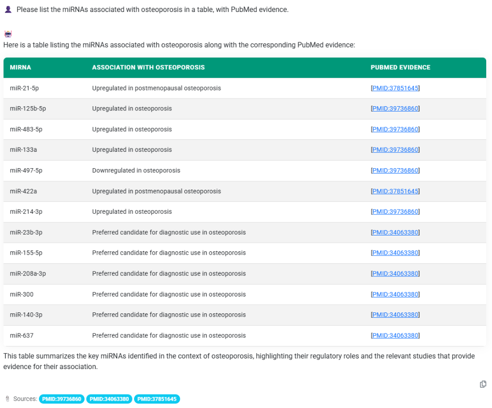
  <br>
  <i>Figure 14: Tabular representation of semantic analysis results (e.g., miRNA relationships).</i>
</p>


## ⚙️ Batch Processing vs. Interactive Discovery

While the **Web Interface** provides a full "Interactive Discovery" workflow—including dynamic sub-network selection (Shift+Select) and real-time Hybrid RAG chat—the **CLI** and **API** are designed for automated batch processing and static graph construction. 

- **Interactive Discovery (Web Only)**: Real-time interaction, dynamic graph filtering, and context-aware chat.
- **Batch Processing (CLI/API)**: Static semantic analysis and high-throughput network generation.

---

## 🛠️ Command-Line Interface (CLI)

For high-throughput analysis, use the NetMedEx CLI.

#### Step 1: Search PubMed
```bash
# Search articles by keywords
netmedex search -q '"N-dimethylnitrosamine" AND "Metformin"' --sort score
```

#### Step 2: Build the Network
```bash
# Generate HTML network from annotations
netmedex network -i annotations.pubtator -o network.html -w 2 --community
```

---

## 🐍 Package API

NetMedEx can be integrated directly into your Python pipelines as a library.

```python
# Programmatic Access (API)
from netmedex import search, network
```

---
© 2026 LSBNB Lab@ IIS, Academia Sinica, TAIWAN. Refer to [LICENSE](LICENSE) for details.
